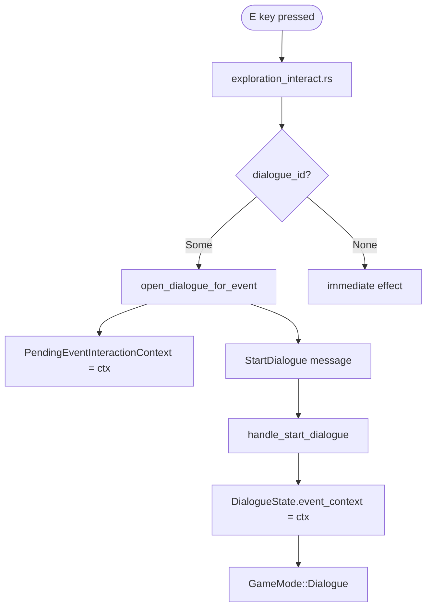
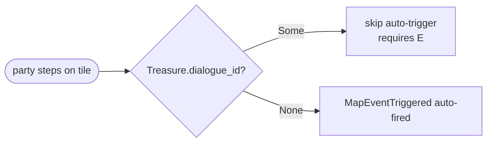
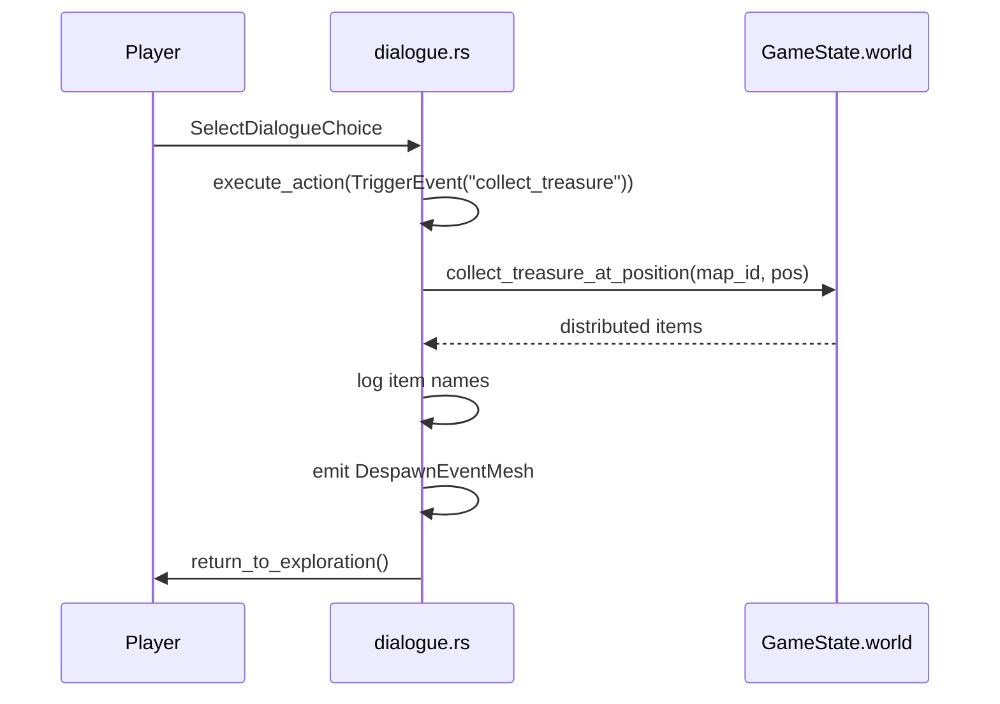

# Dialogue Routing for Interactive World Events

## Overview

Any interactive map event that carries a `dialogue_id` field — `Treasure`, `Sign`,
`Container`, `LockedContainer`, or `LockedDoor` — can open a dialogue tree when the
player presses **[E]** instead of immediately executing its default effect.  The
dialogue tree can then trigger the original effect (collect loot, open a container,
unlock a door) via a `TriggerEvent` action, giving campaign authors full control over
when and how the effect fires.

When `dialogue_id` is `None` the event behaves exactly as it did before this feature
existed — no behaviour change, no RON migration required.

---

## Data Model

### `dialogue_id` field

All five interactive variants in `MapEvent` carry:

```ron
dialogue_id: Some(42),   // opens dialogue tree 42 on [E]
// or
// dialogue_id omitted / None — direct effect as usual
```

| Variant         | Default effect when `dialogue_id` is `None`    |
|-----------------|------------------------------------------------|
| `Treasure`      | Distribute loot to party, remove event         |
| `Sign`          | Show sign text in a dialogue bubble            |
| `Container`     | Enter `ContainerInventory` mode                |
| `LockedContainer` | Prompt for key / lockpick                    |
| `LockedDoor`    | Prompt for key / lockpick / bash               |

### `EventInteractionContext`

When the runtime opens a dialogue for one of these events it stores an
`EventInteractionContext` inside `DialogueState`:

```rust
pub struct EventInteractionContext {
    pub event_position: Position,  // tile that holds the originating event
    pub map_id: MapId,             // map the event lives on
}
```

`TriggerEvent` handlers in `execute_action` read this context to locate and remove the
event after the dialogue concludes.  The field lives on `DialogueState`:

```rust
pub event_context: Option<EventInteractionContext>,
```

It is separate from `recruitment_context` and cleared by `DialogueState::end()`.

---

## Runtime Flow

### [E]-key dispatch



`open_dialogue_for_event` (in `exploration_interact.rs`) performs two steps:

1. Writes `event_position` and `map_id` into `PendingEventInteractionContext`
   (a Bevy `Resource` consumed by `handle_start_dialogue`).
2. Sends a `StartDialogue { dialogue_id, fallback_position, face_speaker_to_party: false }`
   message — no speaker entity, because the event object is not an NPC.

### Treasure auto-trigger guard

`check_for_events` (in `events.rs`) normally auto-fires `MapEventTriggered` when the
party steps on any unhandled event tile.  A `Treasure` that carries
`dialogue_id: Some(_)` is excluded from this path so the player can read the dialogue
before loot is distributed:



### TriggerEvent execution

After the player works through the dialogue tree a node or choice fires a `TriggerEvent`
action.  `execute_action` reads `DialogueState.event_context` to find the originating
tile.



---

## TriggerEvent Action Reference

The four event-names understood by `execute_action` when `event_context` is set:

### `"collect_treasure"`

Distributes loot from the `Treasure` event at `event_context.event_position`,
removes the event, emits `DespawnEventMesh`, and returns to exploration.

**Prerequisite**: `event_context` must point at a `MapEvent::Treasure`.

```ron
TriggerEvent( event_name: "collect_treasure" )
```

### `"open_container"`

Opens the `Container` event at `event_context.event_position` by entering
`GameMode::ContainerInventory`.  The dialogue mode is replaced by the container
screen; closing the container returns to exploration as usual.

**Prerequisite**: `event_context` must point at a `MapEvent::Container`.

```ron
TriggerEvent( event_name: "open_container" )
```

### `"unlock_door"`

Attempts to unlock the `LockedDoor` at `event_context.event_position`:

- If already unlocked: opens the tile and returns to exploration.
- If locked and party holds the required key: consumes the key, unlocks,
  opens tile, removes event, emits `DespawnEventMesh`, returns to exploration.
- If locked and no key: logs "The door is locked. You need a key." and
  returns to exploration.
- If locked and no key required: logs "The door is locked." and returns to
  exploration (lockpick / bash not available via dialogue action).

```ron
TriggerEvent( event_name: "unlock_door" )
```

### `"unlock_container"`

Attempts to unlock the `LockedContainer` at `event_context.event_position`.
On success, unlocks the container and immediately enters
`GameMode::ContainerInventory` so the party can take items.  On failure,
logs the reason and returns to exploration.

```ron
TriggerEvent( event_name: "unlock_container" )
```

---

## Authoring Guide

### Minimal Treasure with dialogue

```ron
// in data/maps/dungeon.ron  events section:
(5, 3): Treasure(
    name: "Barred Passage",
    description: "A heavy iron gate blocks the way.",
    loot: [7],           // item ID 7 = "Iron Key"
    mesh_id: Some("iron_gate"),
    dialogue_id: Some(10),
),
```

```ron
// in data/dialogues.ron — dialogue id 10:
(
    id: 10,
    name: "Barred Passage",
    root_node: 1,
    speaker_name: Some("Gate"),
    repeatable: false,
    nodes: {
        1: (
            id: 1,
            text: "A heavy iron gate stands before you.",
            choices: [
                (
                    text: "Force it open.",
                    target_node: None,
                    ends_dialogue: true,
                    actions: [TriggerEvent( event_name: "collect_treasure" )],
                ),
                (
                    text: "Leave it.",
                    target_node: None,
                    ends_dialogue: true,
                    actions: [],
                ),
            ],
        ),
    },
)
```

### Locked chest with dialogue choice

```ron
// event
(3, 7): LockedContainer(
    name: "Ancient Chest",
    lock_id: "chest_ancient",
    key_item_id: Some(12),
    items: [(item_id: 55, charges: 0)],
    mesh_id: Some("chest_iron"),
    dialogue_id: Some(20),
),
```

```ron
// dialogue 20
(
    id: 20,
    name: "Ancient Chest",
    root_node: 1,
    speaker_name: Some("Chest"),
    repeatable: true,
    nodes: {
        1: (
            id: 1,
            text: "A heavy chest bound with old iron. A keyhole is clearly visible.",
            choices: [
                (
                    text: "Use my key.",
                    target_node: None,
                    ends_dialogue: true,
                    actions: [TriggerEvent( event_name: "unlock_container" )],
                ),
                (
                    text: "Leave it.",
                    target_node: None,
                    ends_dialogue: true,
                    actions: [],
                ),
            ],
        ),
    },
)
```

---

## Routing Table

| Trigger path | Applies to | `dialogue_id` check location |
|---|---|---|
| [E] key — locked door | `LockedDoor` | `try_interact_locked_door_event` |
| [E] key — locked container | `LockedContainer` | `try_interact_locked_container_event` |
| [E] key — sign / container / treasure (adjacent or current tile) | `Sign`, `Container`, `Treasure` | `try_interact_adjacent_world_events` |
| Step-on auto-trigger | `Treasure` only | `check_for_events` (skips when `dialogue_id: Some`) |

All other variants (`Encounter`, `Teleport`, `NpcDialogue`, `RecruitableCharacter`,
`Furniture`, `DroppedItem`) are unaffected.

---

## Resource and Message Reference

| Symbol | Module | Purpose |
|---|---|---|
| `PendingEventInteractionContext` | `game::systems::dialogue` | Bridges [E]-dispatch and `handle_start_dialogue`; cleared after use |
| `EventInteractionContext` | `application::dialogue` | Position + map ID of the originating event; stored in `DialogueState` |
| `open_dialogue_for_event` | `game::systems::input::exploration_interact` | Sets context, writes `StartDialogue` |
| `StartDialogue` | `game::systems::dialogue` | Requests `GameMode::Dialogue` transition |
| `DespawnEventMesh` | `game::systems::map` | Removes mesh entity for a consumed event |
| `collect_treasure_at_position` | `application` (`GameState`) | Distributes loot, removes event, returns distributed pairs |

---

## Behaviour Guarantees

- **Backward compatibility**: all existing RON map files that omit `dialogue_id` (or set
  it to `None`) are unaffected.  No migration is required.
- **Single consumption**: `collect_treasure_at_position` calls `map.remove_event` once
  regardless of inventory capacity.  Items that cannot be placed are silently lost; the
  event is always removed.
- **Mesh despawn**: `DespawnEventMesh` is emitted by all TriggerEvent handlers that
  consume an event, so any `mesh_id` visual disappears in the same frame.
- **Dialogue state cleanup**: `DialogueState::end()` and `return_to_exploration` both
  clear `event_context` so stale context cannot bleed into a subsequent dialogue.
